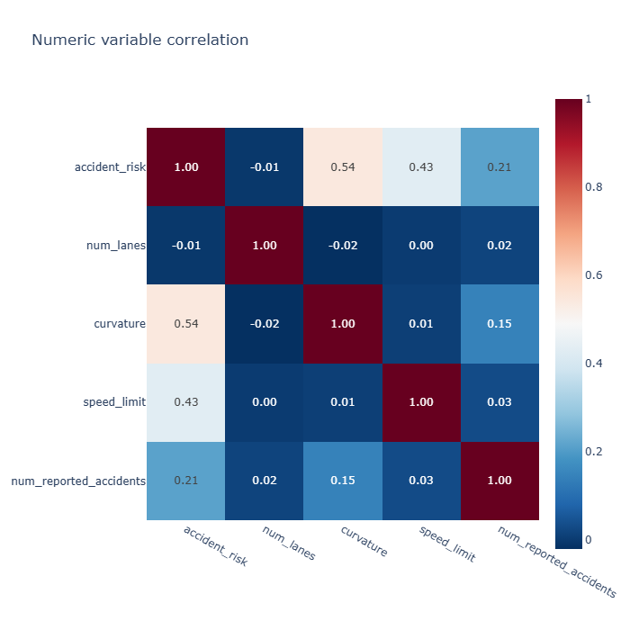
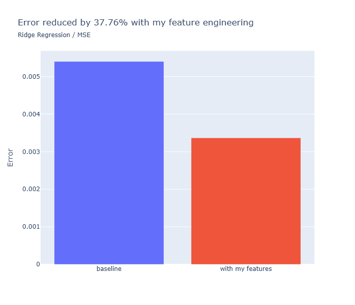
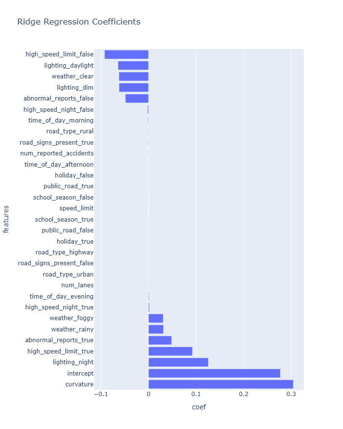
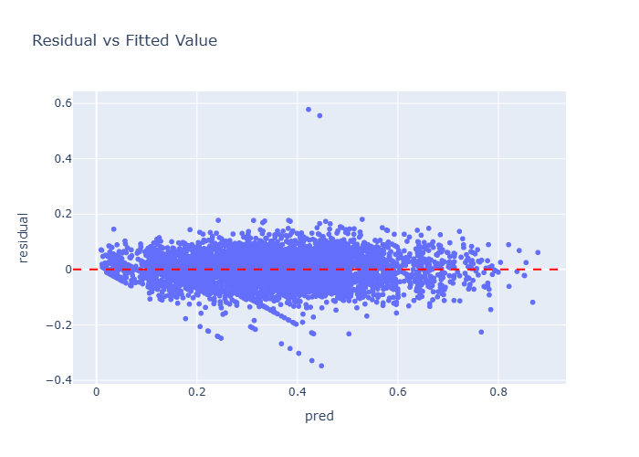

[-> 跳轉至中文翻譯 <-](#道路交通事故風險預測)

# Road Accident Risk Prediction

A machine learning project predicting traffic accident risk using feature engineering and regression modeling techniques. This project demonstrates end-to-end data science workflow from exploratory analysis to model deployment.

**[Kaggle Competition](https://www.kaggle.com/competitions/playground-series-s5e10)** | Evaluation Metric: RMSE | Top 25% Ranking

## Project Highlights

- **37.76% MSE reduction** through strategic feature engineering
- Engineered features enable **Ridge Regression to match XGBoost performance** (comparable MSE/R²)
- Comprehensive EDA with statistical validation and visualization


## Model Performance

| Model | MSE | R² Score | Notes |
|-------|-----|----------|-------|
| Baseline Ridge | 0.0054 | 80.49% | Original features only |
| **Engineered Ridge** | **0.0034 (37.76% ↓)** | **87.84%** | With feature engineering |
| XGBoost | 0.0032 | 88.62% | Similar to engineered Ridge |

*Key insight: With feature engineering, I managed to achieve the **prediction power** of XGBoost AND retain the **interpretability** of Ridge Regression.*

## Technical Stack

**Data Processing & Analysis**
- `polars` - High-performance dataframe operations
- `numpy` - Numerical computing
- `jupyter` - Notebook for EDA

**Visualization**
- `plotly` - Interactive visualizations

**Machine Learning**
- `scikit-learn` - Ridge/Lasso regression, model selection, cross-validation
- `XGBoost` - Gradient boosting baseline
- `EDA_funcs.py` - Custom feature engineering/EDA utility functions

## Methodology

### 1. Exploratory Data Analysis
- Univariate/Bivariate feature analysis
- Correlation analysis

### 2. Feature Engineering
- Domain-driven feature creation
- EDA-driven feature creation
- Interaction terms between key variables

### 3. Model Development
- Baseline model establishment with Ridge Regression/XGBoost
- Hyperparameter tuning via 5-fold cross-validation

### 4. Model Evaluation
- RMSE and R² metrics tracking
- Residual diagnostics (homoscedasticity, normality)
- Feature importance analysis

## Key Engineered Features
- Speed limit binning
- Number of reported accidents binning
- Speed limit X Lighting

## Visualizations

### Correlation Heatmap


*Feature correlation matrix revealing relationships between numerical predictor variables*

### Model Performance Comparison


*Comparison of model performance across different algorithms*

### Feature Coefficients


*Ridge regression coefficients showing feature importance and direction*

### Residual Analysis


*Residual diagnostics confirming model assumptions are satisfied*

## Running the Analysis

```bash
# Install dependencies
uv sync
# or 
pip install -r requirements.txt

# Run the notebook
jupyter notebook cleaned_EDA.ipynb
```

## Project Structure

```
├── data/                     # Dataset
├── models/                   # Trained models (.joblib)
├── notebook/
│   ├── cleaned_EDA.ipynb     # (<- READ THIS) Cleaned notebook 
│   ├── EDA_funcs.py          # Custom utility functions
│   └── raw_EDA.ipynb         # Initial exploration (messy)
├── plots/                    
│   ├── coefficients.png
│   ├── correlation_heatmap.png
│   ├── performance_comparison.png
│   └── residuals.png
├── prediction/                # Model predictions (for Kaggle submissions)
├── pyproject.toml             # Project dependency           
├── requirements.txt           # For pip users
├── README.md                 
└── uv.lock
```

## Skills Demonstrated

- **Feature Engineering**: Domain knowledge application, interaction effects, EDA-driven insights
- **Machine Learning**: Regression modeling, hyperparameter tuning, ensemble methods
- **Model Validation**: Cross-validation, residual analysis, performance metrics
- **Python Libraries**: polars, scikit-learn, XGBoost, plotly

---


# 道路交通事故風險預測

一個使用特徵工程和回歸建模技術預測交通事故風險的機器學習專案。此專案展示了從探索性分析(EDA)到模型部署的端到端數據科學工作流程。

**[Kaggle 競賽](https://www.kaggle.com/competitions/playground-series-s5e10)** | 競賽Metric：RMSE | 前 25% 排名

## 專案亮點

- 通過feature engineering**降低 37.76% MSE**
- 通過feature engineering使**Ridge regression達到與 XGBoost 相當的表現**（MSE/R²）
- 完整的EDA流程及視覺化


## 模型性能

| 模型 | MSE | R² 分數 | 備註 |
|-------|-----|----------|-------|
| Ridge (Baseline) | 0.0054 | 80.49% | 僅使用原始features |
| **Ridge** | **0.0034（↓ 37.76%）** | **87.84%** | 使用feature engineering |
| XGBoost | 0.0032 | 88.62% | 與最終版本 Ridge regression 相近 |

*insights：通過特徵工程，我成功達到了 XGBoost 的**prediction power**，同時保留了 Ridge Regression的**interpretability**。*

## 技術堆疊

**數據處理與分析**
- `polars` - 高性能data wrangling
- `numpy` - 數值運算
- `jupyter` - EDA notebook

**視覺化**
- `plotly` - 互動式視覺化圖表

**機器學習**
- `scikit-learn` - Ridge/Lasso Regression、模型選擇、cross validation
- `XGBoost` - Gradient Boosting Baseline
- `EDA_funcs.py` - 客製化feature engineering/EDA 函數

## Methodology

### 1. 探索性數據分析(EDA)
- 單變量/雙變量特徵分析
- 相關性分析

### 2. 特徵工程
- domain-driven的特徵工程
- EDA-driven的特徵工程
- 關鍵變數之間的interaction

### 3. 模型開發
- 使用 Ridge Regression/XGBoost 建立baseline
- 通過 5 fold cross validation 進行hyperparamter tuning

### 4. 模型評估
- RMSE 和 R² 指標追蹤
- Residual analysis（homoscedasticity, normality）
- Coefficients interpretation

## Key Engineered Features
- Speed limit binning
- Number of reported accidents binning
- Speed limit X Lighting

## 視覺化

### 相關性heatmap


*特徵相關性矩陣，揭示數值預測變數之間的關係*

### 模型比較


*不同演算法的模型性能比較*

### 線性回歸係數


*Ridge 回歸係數顯示特徵重要性和方向*

### Residual Analysis


*殘差診斷確認模型假設得到滿足*

## 執行
```bash
# 安裝dependency
uv sync
# 或 
pip install -r requirements.txt

# run notebook
jupyter notebook cleaned_EDA.ipynb
```

## 專案結構

```
├── data/                     # Dataset
├── models/                   # Trained models (.joblib)
├── notebook/
│   ├── cleaned_EDA.ipynb     # (<- READ THIS) Cleaned notebook 
│   ├── EDA_funcs.py          # Custom utility functions
│   └── raw_EDA.ipynb         # Initial exploration (messy)
├── plots/                    
│   ├── coefficients.png
│   ├── correlation_heatmap.png
│   ├── performance_comparison.png
│   └── residuals.png
├── prediction/                # Model predictions (for Kaggle submissions)
├── pyproject.toml             # Project dependency           
├── requirements.txt           # For pip users
├── README.md                 
└── uv.lock
```

## 展示的技能

- **特徵工程**：domain knowledge應用、interaction effect、EDA-driven insights
- **機器學習**：regression modeling、hyperparameter tuning、ensemble methods
- **模型驗證**：cross validation、residual analysis、performance metrics
- **Python 函式庫**：polars、scikit-learn、XGBoost、plotly

---

